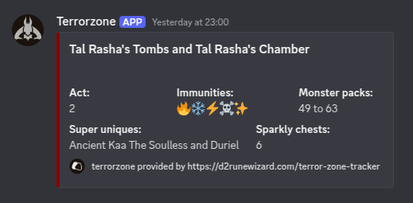

# Terrorzone Discord Webhook

used to write information about the currently active terrorzone in D2:R into a discord channel.



Based on <https://d2runewizard.com/integration>

## Requirements

- docker: <https://docs.docker.com/engine/install/>
  - or rootless docker: <https://docs.docker.com/engine/security/rootless/>
- docker compose: <https://docs.docker.com/compose/install/>
- discord server with a webhook: <https://support.discord.com/hc/en-us/articles/228383668-Intro-to-Webhooks>
  - The webhook link looks like this.
    ```url
    https://discord.com/api/webhooks/{WEBHOOK_ID}/{WEBHOOK_TOKEN}
    ```
- token for the d2runewizard.com TZ API: <https://d2runewizard.com/profile/T41jagcO0UcTLKJiC5UOmDCdGtS2>

## Preparation

- crate a `.secrets` file (example values)
  ```text
  WEBHOOK_ID=1234567890
  WEBHOOK_TOKEN=ABCDEF123456
  ENDPOINT_TZ=https://d2runewizard.com/api/terror-zone
  ENDPOINT_TOKEN=abcdef12345
  CONTACT=whatever@mymail.com
  PLATFORM=Discord MyName#1234
  ```
- crate a `.env` file (example values)
  ```text
  TAG=2.0.1
  UID=65534
  GID=65534
  LOG_PATH=./logs
  ZONEINFO_PATH=./
  LOG_LEVEL=INFO
  PUBLIC_REPO=https://github.com/MyNameIs-13/TerrorZones-Discord
  ```
- (optional) create folder(s) for `logs` and `zone-info.json` and add their path to the `.env` file as `LOG_PATH` & `ZONEINFO_PATH` respectively
  - when an accessible `/app/logs` mount is created, and LOG_LEVEL=DEBUG, log files will be written into this folder. Otherwise they are written to stdout
  - when an accessible `/app/zone-info` mount is created, zone-info.json in this directory is preferred instead of the build in one.
  - the used folder(s) require access right for anybody when the `nobody` user is used to run the container
    ```shell
    mkdir /your/path
    sudo chown -R 65534:65534 /your/path
    chmod -R u+rw /your/path
    ```
- (optional) define UID (UserId) and GID (GroupId) for the user which should be used inside the container (default is nobody)

### Build & run docker container

navigate to folder (`cd /your/path`), then:
```shell
docker compose up
```

to update the image use:
````shell
docker compose up --build
````

## Misc

- The following environment variables can be passed to the docker container:
  - LOG_LEVEL - optional - {INFO, WARNING, ERROR, CRITICAL} (everything else defaults to DEBUG)
  - WEBHOOK_ID - required - id from your discord webhook
  - WEBHOOK_TOKEN - required - token from your discord webhook
  - ENDPOINT_TOKEN - required - personalized token from <https://d2runewizard.com/profile/T41jagcO0UcTLKJiC5UOmDCdGtS2>
  - ENDPOINT_TZ  - optional - api that will be used
  - CONTACT - required - email address
  - PLATFORM - required - other communication method information like Discord, Whatsapp, ...
  - PUBLIC_REPO - required - link to your public repo
- some systems don't support cpus limit, comment-out the limit in `docker-compose.yml`
- Trivy
  - using on machine where image is located
    ```shell
    trivy image d2r-terrorzones:<TAG>
    ```
  - when using a different machine
    ```shell
    # on machine with image
    docker save -o /save/path/d2r-terrorzones.tar d2r-terrorzones:<TAG>
    # -> transfer image cp, scp, rsync, smb, ...
    # on machine with trivy
    trivy image --input /path/to/d2r-terrorzones.tar
    ```
  - current output
    ```text
    /path/to/d2r-terrorzones.tar (alpine 3.21.2)
    Total: 0 (UNKNOWN: 0, LOW: 0, MEDIUM: 0, HIGH: 0, CRITICAL: 0)
    ```

## Links
- how to use d2runewizard api: <https://d2runewizard.com/integration>
- ideas used from: <https://github.com/fredericojordan/d2terror>